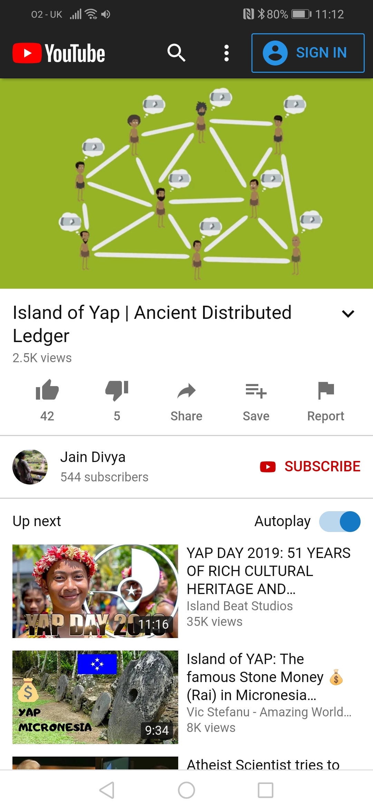

# UbiChipher
A privacy focused, public, open, transparent, decentralised, self-soverin, opens source identity management project. Puts users fully in control of their own digital identity in a secure and very easy to use manner. Similar to ID2020, European Blockchain Services Infrastructure and Decentralized Identity Foundation projects listed below, but without the centralized “walled garden” control. Blockchain is a powerful and inevitable tool. Lets give this power to the people who deserve it. 

Demo (@8:41): https://youtu.be/WbGETEvv1Qk?t=521

## Background
### Blockchain for dummies
Blochain is just common sense. It has been around for centuries. See below.

1. Blockchain is just a distributed ledger, in the same way that the Yappees tribe transferred ownership of Rai Stones on the island of Yap by announcing it to the entire island. But with blockchain it is stored on hard drives instead of mental ledger.
2. Unlike the Yap island, we don't know everyone involved when it comes to blockchain. So we need the proof of work consensus algorithm and this is just spam protection that came from the 1992 email spam protection program by the name of HashCash. It works by making computers guess hard numbers to solve problems so that attacking the network will be very difficult. 
3. Your wallet is just something that stores an encryption key that allows you to sign transactions. It is your identifying signature like the Yappees identified each other by recognising each others faces and voices. 
4. The chain is just a LinkedList where PreviousItem is an actual hash of the previous item. A hash is just like a check sum.

### Features
1. Crypto project this isn’t actually just better, but can actually make things much more convenient.
2. Passwordless authentication.
3. Accountless authentication.
4. Universal KYC
5. Fully privacy focused self Sovereign  digital ID that users can truly own and control.
6.  Simple credit checks, anti-money laundering (AML) even without revealing other details about you. Promotional offers, age checks, gym and students card check. All this can be possible without even revealing your name in the right circumstances.

### System Design

## Video Demos
#### Promotional Video

https://youtu.be/uZ3Whi22M1o

#### Software Demo Video

https://youtu.be/WbGETEvv1Qk

#### Protocol Theory Video

https://youtu.be/ePwzr6Qt3Ks

## Solution Areas
### Data and Services 
#### UbiChipher.Data

- Provides basic data for claims and request.
- Used by the simplified “Test tools” and also the full UbiChipher.WebDemo and UbiChipher.Android

#### UbiChiper.Services

- Contains the validation logic, including blockchain lookup.
- Used by the simplified “Test tools” and also the full UbiChipher.WebDemo and UbiChipher.Android

### Test Tools
#### MobileAppSim

– Simulated mobile app to test the identity claims provision functionality of the mobile app.

#### WebsiteSim

– Simulated website to test the claims challenge and validation functionality.

### Demo Website
#### UbiChipher.WebDemo

- Simple website that demonstrates website functionality (Demo counterpart is WebsiteSim)

### Demo Mobile App
#### UbiChipher.Android

- Simple website that demonstrates the mobile app functionality (Demo counterpart is UbiChipher.Android)

## Other resources
### Decentralized Identity Foundation

https://identity.foundation/

https://github.com/decentralized-identity

### ID2020

https://id2020.org/

### European Blockchain Services Infrastructure (EBSI)

https://ec.europa.eu/cefdigital/wiki/display/CEFDIGITAL/EBSI

### Similar projects

#### Microsoft
##### An introduction to decentralized identities | Azure Friday

https://www.youtube.com/watch?v=r28GeXkxn0w

https://www.microsoft.com/en-gb/security/business/identity/own-your-identity?rtc=1

https://query.prod.cms.rt.microsoft.com/cms/api/am/binary/RE2DjfY

#### IBM promotional video

https://www.youtube.com/watch?v=H69l_trRArU

#### Sovrin

https://www.youtube.com/watch?v=Hg7psADNcVU

#### VIDchain

https://www.youtube.com/watch?v=eRxVWeX389w

#### Bloom ID

https://www.youtube.com/watch?v=ntNKcBlw9FU

#### Civic

https://www.youtube.com/watch?v=sECLU2BfKQs

